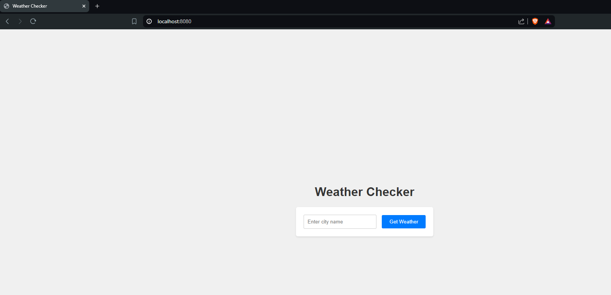

# Go Weather Application

This Go application fetches and displays the weather information for a specified city. The weather data is retrieved from the OpenWeatherMap API and presented on a web page. Users can enter a city name via a form to get the current temperature in Celsius and Fahrenheit.

## Features

- Fetches weather data from OpenWeatherMap API
- Displays temperature in Celsius and Fahrenheit
- User-friendly web interface for entering city names
- Error handling for invalid city names and API issues

## Prerequisites

- Go 1.18 or higher
- OpenWeatherMap API key

## Project Structure

```
go-weather/
├── assets/
│ └── images
├── cmd/
│ └── main/
│ └── main.go
├── pkg/
│ ├── config/
│ │ └── config.go
│ ├── handlers/
│ │ └── handlers.go
│ └── weather/
│ └── weather.go
├── templates/
│ └── form.html
└── .apiConfig
└── .gitignore
└── README.md
```


## Setup

1. **Clone the repository:**

   ```sh
   git clone https://github.com/shaikhjunaidx/go-weather.git
   cd go-weather
   ```

2. **Create an API configuration file:**

    Create a file named `.apiConfig` in the root directory and add your OpenWeatherMap API key:
    
    ```json
    {
        "OpenWeatherMapApiKey": "your_api_key_here"
    }
    ```

3. **Install dependencies:**

    Run the following commands to install any dependencies:
    
    ```sh
    go mod tidy
    ```

4. **Run the application:**
    
    Navigate to the `cmd/main` directory and run the application:

    ```sh
    go run main.go
    ```

5. **Access the application:**

    Open your web browser and go to **`http://localhost:8080`**.


## Usage

- **Accessing the welcome page:**

  Go to `http://localhost:8080/welcome` to see a welcome message.

- **Entering a city name:**

  On the main page (`http://localhost:8080`), enter the name of a city in the input field and click "Get Weather". The weather information for the city will be displayed on the same page.

- **Direct URL access:**

  You can also directly access the weather information for a city by navigating to `http://localhost:8080/weather/{city_name}`.

## Example

1. **Form submission:**

   

2. **Weather information display:**

   

